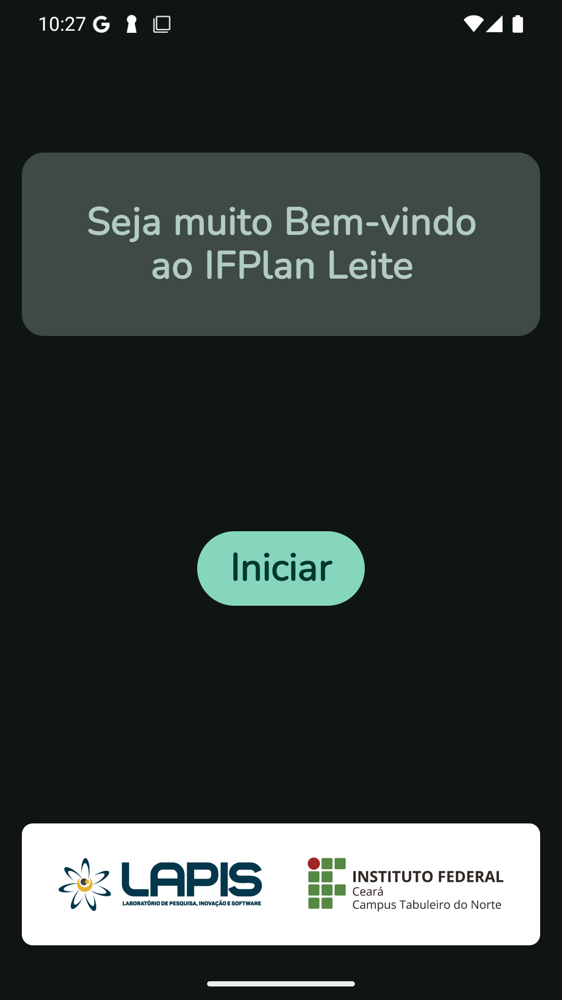
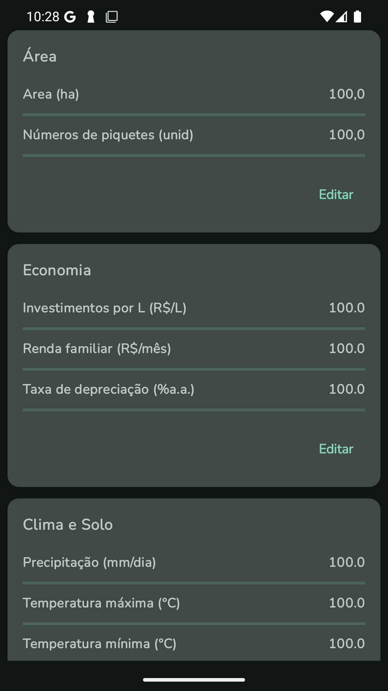
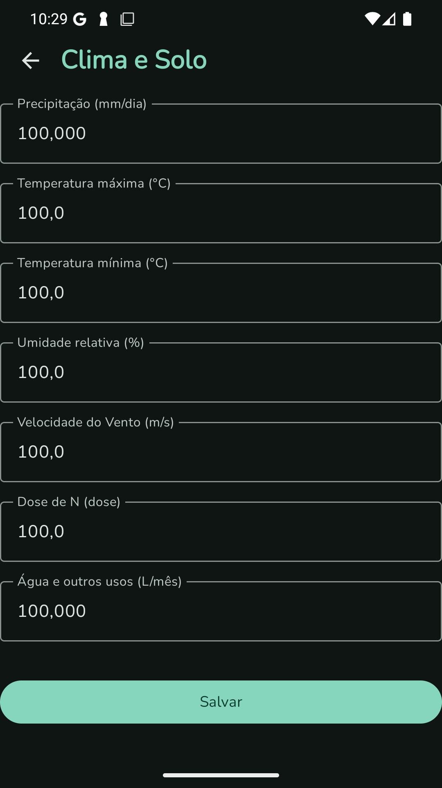
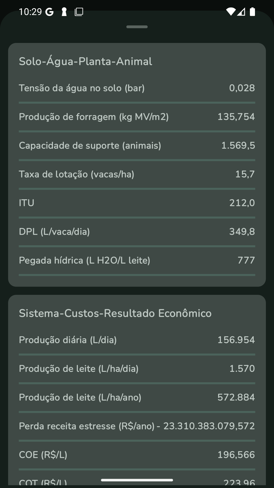

# IFPlan Leite

### O que é?

IFPlan Leite é o aplicativo ideal para produtores de leite que desejam aprimorar a gestão da produção com inteligência e precisão. Desenvolvido especialmente para
otimizar o planejamento e o uso dos recursos da propriedade, ele oferece uma interface prática e intuitiva, permitindo o controle eficiente de diversos fatores que 
impactam a produtividade e a rentabilidade.

### Funcionalidades
Principais Funcionalidades:

1. Simulações Precisas e Personalizadas;
2. Gestão de Recursos e Suporte à Decisão;
3. Análise Financeira Completa;
4. Monitoramento Ambiental e Sustentabilidade;
5. Produção e Disponibilidade de Forragem;
6. Avaliação de Saúde e Bem-Estar Animal.

### Telas

1. Tela de boas vindas
   

2. Tela de dashboards

3. Tela de inserção de dados

4. Tela de resultados

### Tecnologias

- Android Studio
- Kotlin
- Hilt
- Arquitetura MVVM
- ROOM Database
- Material Theme 3